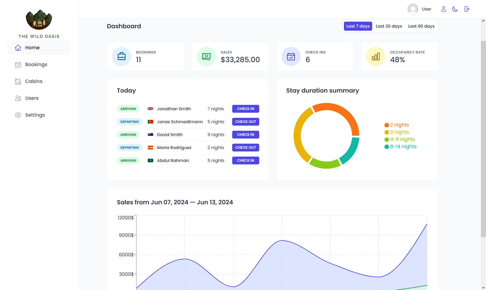

# The Wild Oasis

## About

"The Wild Oasis" is a small boutique hotel with 8 luxurious wooden cabins. This custom-built fullstack application manages everything about the hotel, including bookings, cabins, and guests. [Live Demo](https://wild-oasis-dutta.vercel.app).

## Tech Stack

- React.js
- Supabase
- Styled Components
- React Router
- React Query
- React Hook Form
- Vite
- Other tools: Recharts, React hot toast, React icons, date-fns

## Pages

- `/dashboard`
- `/bookings`
- `/cabins`
- `/checkin`
- `/settings`
- `/users`
- `/login`

## Features

### Authentication

- Users of the app are hotel employees who need to log in to perform tasks.
- Only authorized users can log in and use the application.
- Users are authenticated using Supabase authentication.
- The authentication process includes a two-factor authentication (2FA) step. Users receive an email to verify their identity before they can access the application.
- New users can only be signed up inside the application to ensure that only actual hotel employees get accounts.
- Users can upload & update an avatar, and change their name and password.

### Cabins

- The app provides a table view with all cabins, showing the cabin photo, name, capacity, price, and current discount.
- Users can update or delete a cabin, and create new cabins (including uploading a photo).

### Bookings

- The app features a table view with all bookings, showing arrival and departure dates, status, paid amount, and cabin and guest data.
- Booking statuses include "unconfirmed" (booked but not yet checked in), "checked in", or "checked out". The table is filterable by this status.
- Other booking data includes: number of guests, number of nights, guest observations, whether they booked breakfast, and breakfast price.

### Check In / Out

- Users can delete, check in, or check out a booking as the guest arrives (no editing for now).
- Bookings may not be paid yet on guest arrival. Therefore, on check-in, users need to accept payment (outside the app) and confirm receipt of payment (inside the app).
- On check-in, guests can add breakfast for the entire stay if they haven't already.

### Guests

- Guest data includes: full name, email, national ID, nationality, and a country flag for easy identification.

### Dashboard

- The initial app screen is a dashboard displaying important information for the last 7, 30, or 90 days.
- A list of guests checking in and out on the current day, with the ability to perform these tasks from the dashboard.
- Statistics on recent bookings, sales, check-ins, and occupancy rate.
- A chart showing all daily hotel sales, displaying both "total" sales and "extras" sales (only breakfast at the moment).
- A chart showing statistics on stay durations, an important metric for the hotel.

### Settings

- Users can define a few application-wide settings: breakfast price, minimum and maximum nights per booking, and maximum guests per booking.
- Includes a dark mode option.

## Learnings

- Gained proficiency with Supabase to create fullstack applications, including database creation and using the API to create, read, update, and delete items.
- Became adept at using advanced React patterns to create reusable components, employing the compound component pattern.
- Learned to manage remote state efficiently using React Query.
- Acquired skills in managing forms using React Hook Form.

## Improvements

- Implement the functionality to create new bookings as guests arrive. [✅ Feature Added]
- Enable editing of existing bookings.
- Allow modifications to check-in and check-out times.
- Implement dynamic pricing for cabins, allowing prices to vary.
- Upon guest checkout, navigate to a different page to generate a PDF invoice and automatically email it to the guest.
